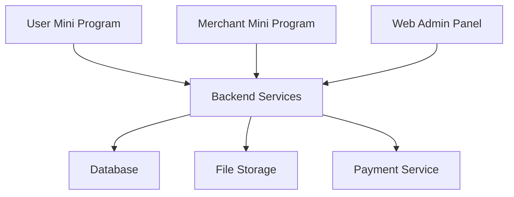

# Campus Second-hand Trading Platform | 校园二手交易平台

<div align="center">

[](./README_backend.md)
[](./user/work/README_user.md)
[](./Admin/README_admin.md)
[](./LICENSE)

🌏 [English](./README.md) | [简体中文](./README_zh.md)

</div>

## 📝 Table of Contents
- [About](#about)
- [System Architecture](#architecture)
- [Features](#features)
- [Tech Stack](#tech-stack)
- [Getting Started](#getting-started)
- [Deployment](#deployment)
- [Documentation](#documentation)
- [Contributing](#contributing)
- [License](#license)

## 🎯 About <a name = "about"></a>

A comprehensive campus second-hand trading platform that consists of:
- 📱 WeChat Mini Program for users
- 💼 WeChat Mini Program for merchants
- 🖥️ Web admin panel
- 🚀 Spring Boot backend services

## 🏗️ System Architecture <a name = "architecture"></a>



## ✨ Features <a name = "features"></a>

### 👥 User Mini Program
- Product browsing and search
- Shopping cart management
- Order management
- Address management
- User profile
- Payment integration

### 🏪 Merchant Mini Program
- Product management
- Order processing
- Business statistics
- Store management
- Customer feedback

### 👨‍💼 Admin Panel
- User management
- Merchant management
- Order oversight
- Category management
- Content moderation
- System monitoring

## 🛠️ Tech Stack <a name = "tech-stack"></a>

| Module | Technology |
|--------|------------|
| Backend | Spring Boot, MyBatis, JWT |
| User/Merchant Frontend | WeChat Mini Program |
| Admin Frontend | HTML5, CSS3, JavaScript |
| Database | MySQL |
| Storage | Aliyun OSS |
| Payment | WeChat Pay |

## 🚀 Getting Started <a name = "getting-started"></a>

### Prerequisites
- JDK 1.8+
- MySQL 5.7+
- WeChat Developer Tools
- Node.js 12+

### Installation

1. Clone the repository
```bash
git clone https://github.com/your-username/campus-trading-platform.git
```

2. Set up backend
```bash
cd backend
mvn install
```

3. Set up admin panel
```bash
cd admin
npm install
```

4. Import Mini Programs to WeChat Developer Tools

## 📦 Deployment <a name = "deployment"></a>

Detailed deployment guides:
- [Backend Deployment Guide](./README_backend.md#deployment)
- [Admin Panel Deployment Guide](./Admin/README_admin.md#deployment)
- [Mini Program Release Guide](./user/work/README_user.md#deployment)

## 📚 Documentation <a name = "documentation"></a>

- [API Documentation](./Admin/API.md)
- [Backend Documentation](./README_backend.md)
- [User Mini Program Documentation](./user/work/README_user.md)
- [Merchant Mini Program Documentation](./Marketer/README_marketer.md)
- [Admin Panel Documentation](./Admin/README_admin.md)

## 🤝 Contributing <a name = "contributing"></a>

1. Fork the Project
2. Create your Feature Branch (`git checkout -b feature/AmazingFeature`)
3. Commit your Changes (`git commit -m 'Add some AmazingFeature'`)
4. Push to the Branch (`git push origin feature/AmazingFeature`)
5. Open a Pull Request

## 📄 License <a name = "license"></a>

This project is licensed under the MIT License - see the [LICENSE](./LICENSE) file for details. 