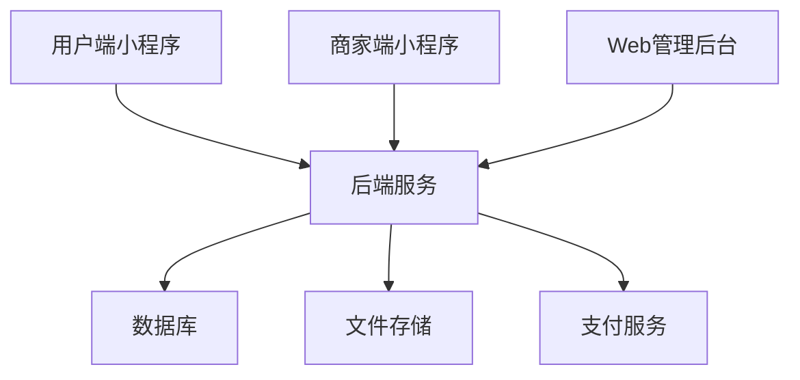

# 校园二手交易平台 | Campus Second-hand Trading Platform

<div align="center">

[](./README_backend.md)
[](./user/work/README_user.md)
[](./Admin/README_admin.md)
[](./LICENSE)

🌏 [English](./README.md) | [简体中文](./README_zh.md)

</div>

## 📝 目录
- [项目简介](#about)
- [系统架构](#architecture)
- [功能特性](#features)
- [技术栈](#tech-stack)
- [快速开始](#getting-started)
- [部署指南](#deployment)
- [项目文档](#documentation)
- [贡献指南](#contributing)
- [开源协议](#license)

## 🎯 项目简介 <a name = "about"></a>

一个完整的校园二手交易平台，包含：
- 📱 面向用户的微信小程序
- 💼 面向商家的微信小程序
- 🖥️ Web管理员后台
- 🚀 Spring Boot后端服务

## 🏗️ 系统架构 <a name = "architecture"></a>



## ✨ 功能特性 <a name = "features"></a>

### 👥 用户端小程序
- 商品浏览与搜索
- 购物车管理
- 订单管理
- 地址管理
- 用户信息
- 支付集成

### 🏪 商家端小程序
- 商品管理
- 订单处理
- 经营统计
- 店铺管理
- 客户反馈

### 👨‍💼 管理员后台
- 用户管理
- 商家管理
- 订单监督
- 分类管理
- 内容审核
- 系统监控

## 🛠️ 技术栈 <a name = "tech-stack"></a>

| 模块 | 技术 |
|--------|------------|
| 后端 | Spring Boot, MyBatis, JWT |
| 用户/商家前端 | 微信小程序 |
| 管理员前端 | HTML5, CSS3, JavaScript |
| 数据库 | MySQL |
| 存储 | 阿里云OSS |
| 支付 | 微信支付 |

## 🚀 快速开始 <a name = "getting-started"></a>

### 环境要求
- JDK 1.8+
- MySQL 5.7+
- 微信开发者工具
- Node.js 12+

### 安装步骤

1. 克隆仓库
```bash
git clone https://github.com/your-username/campus-trading-platform.git
```

2. 配置后端
```bash
cd backend
mvn install
```

3. 配置管理后台
```bash
cd admin
npm install
```

4. 导入小程序到微信开发者工具

## 📦 部署指南 <a name = "deployment"></a>

详细部署指南：
- [后端部署指南](./README_backend.md#deployment)
- [管理后台部署指南](./Admin/README_admin.md#deployment)
- [小程序发布指南](./user/work/README_user.md#deployment)

## 📚 项目文档 <a name = "documentation"></a>

- [API文档](./Admin/API.md)
- [后端文档](./README_backend.md)
- [用户端小程序文档](./user/work/README_user.md)
- [商家端小程序文档](./Marketer/README_marketer.md)
- [管理后台文档](./Admin/README_admin.md)

## 🤝 贡献指南 <a name = "contributing"></a>

1. Fork 本仓库
2. 创建特性分支 (`git checkout -b feature/AmazingFeature`)
3. 提交更改 (`git commit -m '添加一些特性'`)
4. 推送到分支 (`git push origin feature/AmazingFeature`)
5. 提交 Pull Request

## 📄 开源协议 <a name = "license"></a>

本项目采用 MIT 协议 - 查看 [LICENSE](./LICENSE) 文件了解详情 