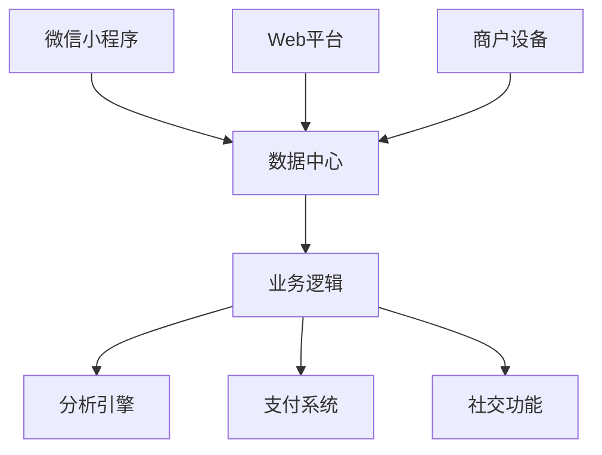

<div align="center">

# 数字夜市平台 🌃

[English](README.md) | [中文](#中文)

[](LICENSE)
[](WeChat%20Mini%20Program)
[](Web)
[](UI-design-for-boothowners-master)

*革新传统夜市的综合数字化解决方案* 🌙

[特性](#特性) • [架构](#架构) • [快速开始](#快速开始) • [文档](#文档) • [贡献](#贡献)

</div>

## 特性

### 🎯 核心组件

| 组件 | 描述 |
|------|------|
| 📱 微信小程序 | 面向消费者的移动应用，用于浏览和下单 |
| 💻 Web平台 | 商户管理后台，提供数据分析和库存控制 |
| 🖥️ 商户设备 | 基于树莓派的触摸屏设备，用于实时订单处理 |

### 🚀 主要功能

- **多平台集成**
  - 全平台无缝同步
  - 实时数据更新
  - 统一用户体验

- **智能商业解决方案**
  - AI驱动的商户匹配
  - 动态价格优化
  - 实时客流管理

- **文化创新**
  - 数字化成就系统
  - 虚拟社区功能
  - 本地文化融合

## 架构



### 🏗️ 技术栈

| 层级 | 技术 |
|------|------|
| 前端 | Vue.js, 微信小程序 |
| 后端 | Node.js, Python |
| 数据库 | 分布式数据库 |
| 设备 | 树莓派, PyQt5 |

## 快速开始

### 环境要求

```bash
# Node.js环境
node -v >= 14.0.0

# Python环境
python -v >= 3.8.0

# 包管理器
npm install
pip install -r requirements.txt
```

### 安装步骤

1. 克隆仓库
```bash
git clone https://github.com/your-org/digital-night-market.git
cd digital-night-market
```

2. 设置各组件：

```bash
# Web平台
cd Web
npm install
npm run serve

# 小程序
cd WeChat\ Mini\ Program
# 使用微信开发者工具打开

# 商户设备
cd UI-design-for-boothowners-master
pip install -r requirements.txt
python main.py
```

## 文档

- [平台愿景](Docs/platform_vision.md)
- [Web平台指南](Web/README_Web.md)
- [小程序指南](WeChat%20Mini%20Program/README_WeChat_Mini_Program.md)
- [商户设备手册](UI-design-for-boothowners-master/README_booth_device.md)

## 贡献

我们欢迎各种形式的贡献！在提交Pull Request之前，请阅读我们的[贡献指南](CONTRIBUTING.md)。

## 开源协议

本项目采用MIT协议 - 查看[LICENSE](LICENSE)文件了解详情。

## 联系方式

- 项目经理: [name@example.com](mailto:name@example.com)
- 技术支持: [support@example.com](mailto:support@example.com)

---

<div align="center">

由数字夜市团队用 ❤️ 打造

</div> 