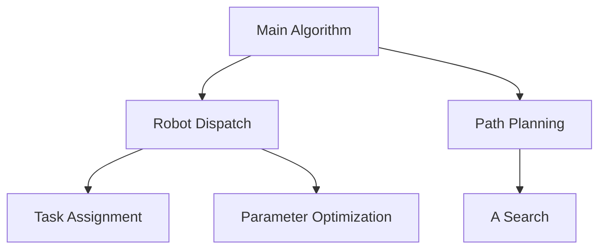

# Robot Dispatch Algorithm

<p align="center">
  
  
  
</p>

[中文](README_zh.md) | English

## Overview

This project is a solution for the 2024 Huawei Software Elite Challenge. It implements an intelligent robot dispatch algorithm to optimize the logistics and transportation in a warehouse scenario.

### Key Features

- Multi-robot coordination and path planning
- Genetic algorithm based parameter optimization
- Real-time response to dynamic task allocation
- Collision avoidance and deadlock prevention

## Architecture 



## Core Components

| Component | Description | Implementation |
|-----------|-------------|----------------|
| Robot Dispatch | Core scheduling logic | C++ |
| Path Planning | A* based path search | C++ |
| Parameter Tuning | Genetic algorithm optimization | Python |

## Quick Start

1. Compile the C++ code:

```bash
g++ -c main.cpp
g++ main.o -o main
```

2. Run parameter optimization:
```bash
python auto_adjust_paras.py
```

## Algorithm Details

### Robot Dispatch Strategy
- Dynamic task allocation based on multiple factors:
  - Distance to target
  - Task priority
  - Robot status
  - System load balance

### Parameter Optimization
The genetic algorithm optimizes key parameters including:
- JUDGE: Path evaluation threshold
- COUNT_MAX: Maximum search iterations
- Various weight factors for the fitness function

## Contributing

Feel free to contribute to this project by:
- Reporting issues
- Submitting pull requests
- Suggesting improvements

## License

This project is licensed under the MIT License - see the [LICENSE](LICENSE) file for details.

## Acknowledgments

- Huawei Software Elite Challenge 2024 organizing committee
- All contributors to this project