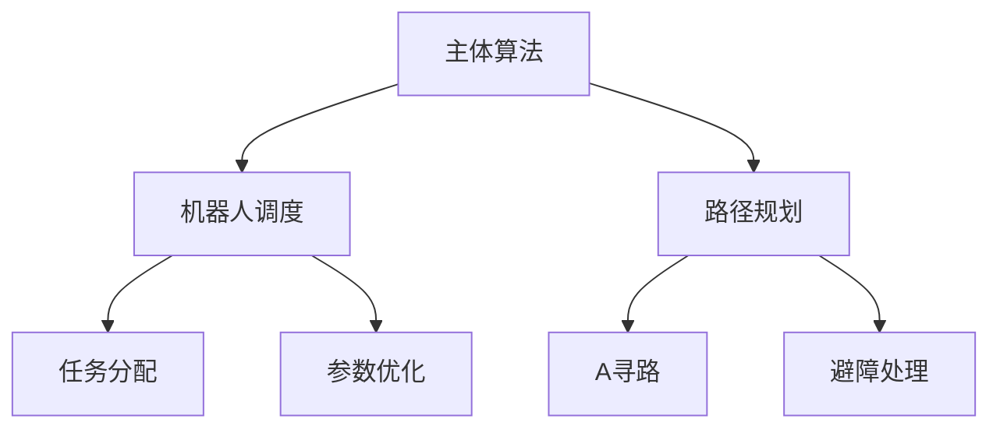

# 机器人调度算法

<p align="center">
  
  
  
</p>

中文 | [English](README.md)

## 项目概述

本项目是2024华为软件精英挑战赛的参赛方案，实现了一个智能机器人调度算法，用于优化仓储场景下的物流运输。

### 核心特性

- 多机器人协同调度与路径规划
- 基于遗传算法的参数优化
- 动态任务分配的实时响应
- 避障与死锁预防机制

## 系统架构 



## 核心组件


| 组件 | 说明 | 实现方式 |
|------|------|----------|
| 机器人调度 | 核心调度逻辑 | C++ |
| 路径规划 | 基于A*的路径搜索 | C++ |
| 参数调优 | 遗传算法优化 | Python |

## 快速开始

1. 编译C++代码：

```bash 
g++ -c main.cpp
g++ main.o -o main
```

2. 运行参数优化：

```bash
python auto_adjust_paras.py
```


## 算法详解

### 机器人调度策略
- 基于多因素的动态任务分配：
  - 目标距离
  - 任务优先级
  - 机器人状态
  - 系统负载均衡

### 参数优化
遗传算法优化的关键参数包括：
- JUDGE: 路径评估阈值
- COUNT_MAX: 最大搜索迭代次数
- 适应度函数的各项权重因子

## 参与贡献

欢迎通过以下方式参与项目：
- 提交问题报告
- 提供代码贡献
- 提出改进建议

## 开源协议

本项目采用MIT协议 - 详见 [LICENSE](LICENSE) 文件

## 致谢

- 2024华为软件精英挑战赛组委会
- 所有项目贡献者