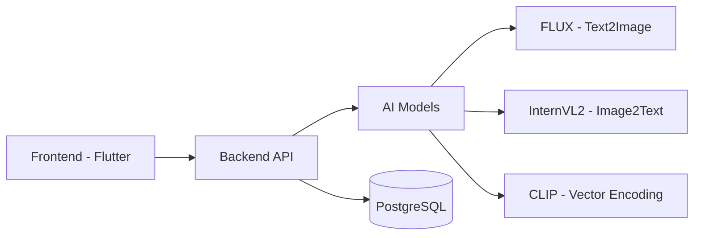

<div align="center">

# I2T Magic 🎨

[](Backend/)
[](Frontend/)
[](Backend/)
[](Frontend/)
[](LICENSE)

[English](README.md) | [简体中文](README_zh.md)

AI-powered Image & Text Assistant - Create, Search, and Transform with Intelligence

📚 **Detailed Documentation**: 
- [Backend Documentation (English)](Backend/README_backend.md) | [后端文档](Backend/README_backend_zh.md)
- [Frontend Documentation (English)](Frontend/README_frontend.md) | [前端文档](Frontend/README_frontend_zh.md)


</div>

## 🌟 Overview

I2T Magic is a powerful AI-driven platform that bridges the gap between images and text. It offers seamless image-to-text conversion, text-to-image generation, intelligent image search, and comprehensive album management capabilities.

## ✨ Core Features

<table>
  <tr>
    <td width="50%">
      <h3>🖼️ Image Intelligence</h3>
      <ul>
        <li>Image-to-text description generation</li>
        <li>Vector-based similarity search</li>
        <li>Batch processing support</li>
      </ul>
    </td>
    <td width="50%">
      <h3>✍️ Creative Generation</h3>
      <ul>
        <li>Text-to-image creation</li>
        <li>Multiple style options</li>
        <li>Real-time generation progress</li>
      </ul>
    </td>
  </tr>
  <tr>
    <td width="50%">
      <h3>💾 Smart Storage</h3>
      <ul>
        <li>Cloud-based image management</li>
        <li>Efficient vector storage</li>
        <li>Automatic synchronization</li>
      </ul>
    </td>
    <td width="50%">
      <h3>🔐 Security & Performance</h3>
      <ul>
        <li>JWT authentication</li>
        <li>Optimized search algorithms</li>
        <li>Scalable architecture</li>
      </ul>
    </td>
  </tr>
</table>

## 🏗️ Architecture



## 🚀 Quick Start

### Prerequisites
- Python 3.8+
- Flutter 3.x
- PostgreSQL 13+

### Backend Setup
```bash
cd Backend
pip install -r requirements.txt
cp .env.example .env
flask db upgrade
python run.py
```

### Frontend Setup
```bash
cd Frontend
flutter pub get
flutter run
```

## 📚 Documentation

- [Backend API Documentation](Backend/API.md)
- [Frontend Development Guide](Frontend/README_frontend.md)
- [Contributing Guidelines](CONTRIBUTING.md)

## 🛠️ Tech Stack

<details>
<summary>Click to expand</summary>

### Backend
- Flask + SQLAlchemy
- PostgreSQL
- AI Models (FLUX, InternVL2, CLIP)

### Frontend
- Flutter 3.x
- Provider (State Management)
- Dio (Network)
- Aliyun OSS (Storage)

</details>

## 📊 Project Structure

```
.
├── Backend/
│   ├── app/
│   ├── config.py
│   └── run.py
├── Frontend/
│   ├── lib/
│   └── pubspec.yaml
├── README.md
└── README_zh.md
```

## 🤝 Contributing

Contributions are welcome! Please read our [Contributing Guidelines](CONTRIBUTING.md) before submitting PRs.

## 📄 License

This project is licensed under the MIT License - see the [LICENSE](LICENSE) file for details.

## 🙏 Acknowledgments

- FLUX model team
- InternVL2 model team
- [@jiangziyi12](https://github.com/jiangziyi12)
- [@qqmmyy](https://github.com/qqmmyy)
- [@yoceany](https://github.com/yoceany)
- All contributors
---

<div align="center">
Made with ❤️ by the I2T Magic Team
</div>
