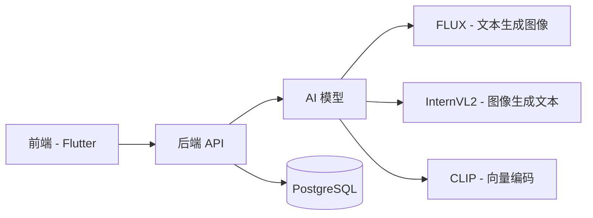

<div align="center">

# I2T Magic 图文助手 🎨

[](Backend/)
[](Frontend/)
[](Backend/)
[](Frontend/)
[](LICENSE)

[English](README.md) | [简体中文](README_zh.md)

AI驱动的图文助手 - 智能创作、搜索与转换

📚 **详细文档**：
- [Backend Documentation (English)](Backend/README_backend.md) | [后端文档](Backend/README_backend_zh.md)
- [Frontend Documentation (English)](Frontend/README_frontend.md) | [前端文档](Frontend/README_frontend_zh.md)


</div>

## 🌟 项目概述

I2T Magic 是一个强大的AI驱动平台，致力于连接图像与文本世界。它提供流畅的图像到文本转换、文本生成图像、智能图像搜索和全面的相册管理功能。

## ✨ 核心功能

<table>
  <tr>
    <td width="50%">
      <h3>🖼️ 图像智能</h3>
      <ul>
        <li>图像到文本描述生成</li>
        <li>基于向量的相似度搜索</li>
        <li>批量处理支持</li>
      </ul>
    </td>
    <td width="50%">
      <h3>✍️ 创意生成</h3>
      <ul>
        <li>文本到图像创作</li>
        <li>多种风格选项</li>
        <li>实时生成进度</li>
      </ul>
    </td>
  </tr>
  <tr>
    <td width="50%">
      <h3>💾 智能存储</h3>
      <ul>
        <li>云端图像管理</li>
        <li>高效向量存储</li>
        <li>自动同步</li>
      </ul>
    </td>
    <td width="50%">
      <h3>🔐 安全与性能</h3>
      <ul>
        <li>JWT身份认证</li>
        <li>优化搜索算法</li>
        <li>可扩展架构</li>
      </ul>
    </td>
  </tr>
</table>

## 🏗️ 系统架构



## 🚀 快速开始

### 环境要求
- Python 3.8+
- Flutter 3.x
- PostgreSQL 13+

### 后端设置
```bash
cd Backend
pip install -r requirements.txt
cp .env.example .env
flask db upgrade
python run.py
```

### 前端设置
```bash
cd Frontend
flutter pub get
flutter run
```

## 📚 文档

- [后端 API 文档](Backend/API.md)
- [前端开发指南](Frontend/README_frontend.md)
- [贡献指南](CONTRIBUTING.md)

## 🛠️ 技术栈

<details>
<summary>点击展开</summary>

### 后端
- Flask + SQLAlchemy
- PostgreSQL
- AI 模型 (FLUX, InternVL2, CLIP)

### 前端
- Flutter 3.x
- Provider (状态管理)
- Dio (网络请求)
- 阿里云 OSS (存储)

</details>

## 📊 项目结构

```
.
├── Backend/
│   ├── app/
│   ├── config.py
│   └── run.py
├── Frontend/
│   ├── lib/
│   └── pubspec.yaml
├── README.md
└── README_zh.md
```

## 🤝 贡献

欢迎贡献！提交PR前请阅读我们的[贡献指南](CONTRIBUTING.md)。

## 📄 许可证

本项目采用 MIT 许可证 - 查看 [LICENSE](LICENSE) 文件了解详情。

## 🙏 致谢

- FLUX 模型团队
- InternVL2 模型团队
- [@jiangziyi12](https://github.com/jiangziyi12)
- [@qqmmyy](https://github.com/qqmmyy)
- [@yoceany](https://github.com/yoceany)
- 所有贡献者
---

<div align="center">
由 I2T Magic 团队用 ❤️ 打造
</div> 