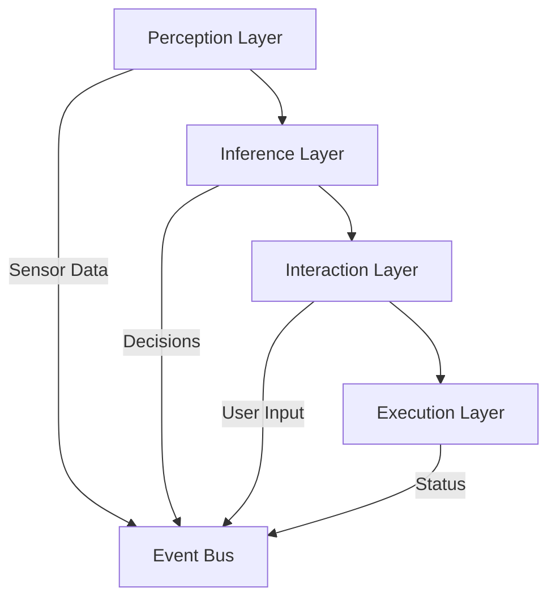
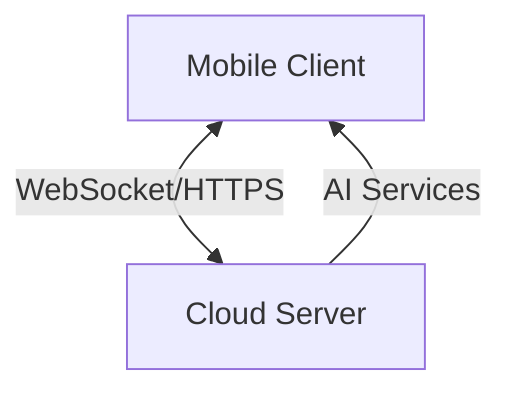
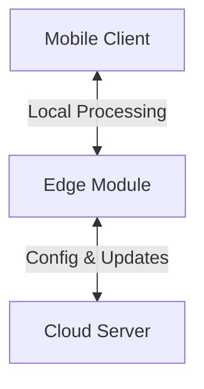
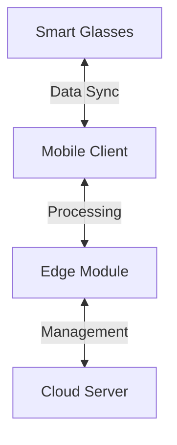
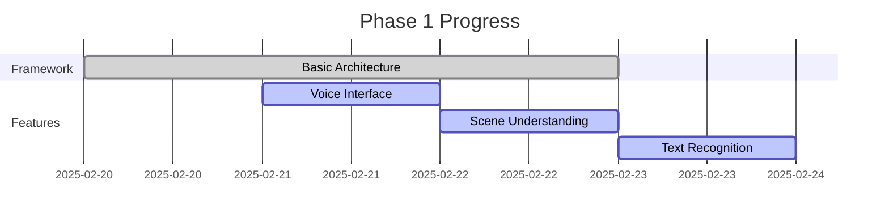
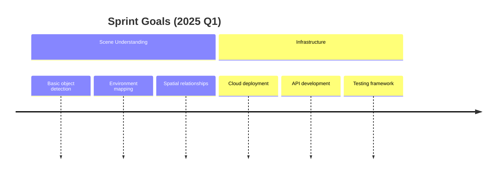

  <h1>🔍 VISTA</h1>
  
<strong>Visual Intelligence Support & Technical Assistant for BLV</strong>

  
  
  
  
  
  
  
  [English](README.md) | [中文](README_zh.md)

## 🌟 Project Vision

VISTA aims to revolutionize how Blind and Low Vision (BLV) individuals interact with their environment through cutting-edge AI technologies. Beyond traditional assistive tools, VISTA strives to become a comprehensive multimodal AI companion that enhances perception, cognition, and interaction capabilities.

## 🎯 Core Challenges We Address

| Challenge | Solution |
|-----------|----------|
| 🚶‍♂️ **Navigation & Mobility** | Advanced sensor fusion (mmWave radar + LiDAR) for all-weather perception |
| 👥 **Social Interaction** | Real-time social cue interpretation and non-visual feedback |
| 📱 **Digital Accessibility** | Seamless multimodal interaction across devices and platforms |
| 🏥 **Healthcare Access** | Intelligent medical assistance and health monitoring |

## 🏗️ System Architecture

### Key Components

1. **Perception System**
   - Multi-sensor fusion
   - Environmental mapping
   - Real-time object tracking
   - Spatial audio processing

2. **Inference Engine**
   - Scene understanding (GPT-4V)
   - Risk assessment
   - Path planning
   - Context awareness

3. **Interaction Interface**
   - Natural language processing
   - Haptic feedback system
   - 3D audio navigation
   - Gesture recognition

## 🛠️ Technology Stack

<table>
  <tr>
    <th>Layer</th>
    <th>Technologies</th>
    <th>Features</th>
  </tr>
  <tr>
    <td>Frontend</td>
    <td>
      
    </td>
    <td>
      - Cross-platform support 
      - Accessible UI/UX 
      - Real-time processing
    </td>
  </tr>
  <tr>
    <td>Backend</td>
    <td>
      
    </td>
    <td>
      - High-performance API 
      - Async processing 
      - Scalable architecture
    </td>
  </tr>
  <tr>
    <td>AI Services</td>
    <td>
      
    </td>
    <td>
      - Scene understanding 
      - Multimodal fusion 
      - Contextual awareness
    </td>
  </tr>
</table>

## 📦 Related Repositories

### Core Components
- 📱 [Vista-frontend](https://github.com/shaowenfu/Vista-frontend) - Flutter mobile application
- 🖥️ [Vista-backend](https://github.com/shaowenfu/Vista_backend) - FastAPI backend server

## 🗺️ Development Roadmap

<table>
<tr>
<td width="33%" valign="top">
<h3>🌤️ Phase 1: Cloud Architecture（Current）</h3>

**Core Components**
- 📱 **Mobile App**
  - Lightweight UI
  - Real-time camera
  - Audio I/O
  - State management
  - Network layer

- ☁️ **Cloud Server**
  - Vision analysis
  - Speech processing
  - Multimodal fusion
  - Real-time processing

**Communication**
- WebSocket streaming
- RESTful APIs
- MQTT state sync

</td>
<td width="33%" valign="top">
<h3>🌥️ Phase 2: Edge Computing</h3>

**Key Updates**
- 🚀 Local AI inference
- ⚡ Ultra-low latency (~10ms)
- 🔒 Enhanced privacy
- 📊 Bandwidth optimization
- 💪 Improved reliability

**Architecture Shift**
- Edge AI deployment
- Cloud management
- Optimized protocols
</td>
<td width="33%" valign="top">
<h3>⛅ Phase 3: Wearable Integration</h3>

**Innovations**
- 🕶️ Smart glasses integration
- 📡 Mesh networking
- 🤝 Device synchronization
- 🔄 Seamless updates
- 🎯 Context awareness

**Benefits**
- Hands-free operation
- Real-time assistance
- Enhanced mobility
</td>
</tr>
</table>

📊 Progress (25%)

**Status**
- ✅ Project initialization
- ✅ Basic architecture setup
- ✅ CI/CD pipeline
- 🚧 Scene understanding module
- ⏳ Text recognition system
- ⏳ Voice interaction interface
- ⏳ Real-time processing

### 📈 Overall Progress

<table>
<tr>
<th>Phase</th>
<th>Status</th>
<th>Progress</th>
<th>Timeline</th>
</tr>
<tr>
<td>Cloud Architecture</td>
<td>🚧 In Progress</td>
<td>
25%
</td>
<td>2025 Q1</td>
</tr>
<tr>
<td>Edge Computing</td>
<td>⏳ Planned</td>
<td>
0%
</td>
<td>2025 Q2</td>
</tr>
<tr>
<td>Wearable Integration</td>
<td>⏳ Planned</td>
<td>
0%
</td>
<td>2025 Q2</td>
</tr>
</table>

### 🎯 Current Sprint Focus

## 🔬 Research Areas

- **Sensor Fusion**: Combining multiple sensor inputs for robust environmental perception
- **Privacy Computing**: Federated learning and differential privacy protection
- **Multimodal AI**: Cross-modal learning and understanding
- **Edge Intelligence**: Distributed AI processing and optimization

## 🤝 Contributing

We welcome contributions from developers, researchers, and domain experts! Please read our [Contributing Guidelines](CONTRIBUTING.md) before submitting PRs.

## 📄 License

This project is licensed under the MIT License - see the [LICENSE](LICENSE) file for details.

## 📚 Documentation

- [Architecture Design](https://github.com/shaowenfu/VISTA/blob/main/Docs/architecture.md)
- [Requirements Analysis](https://github.com/shaowenfu/VISTA/blob/main/Docs/requirements.md)
- [MVP plan](https://github.com/shaowenfu/VISTA/blob/main/Docs/MVP_plan.md)
- [API Documentation](https://github.com/shaowenfu/Vista_backend/docs/api.md)

## 🌐 Community

- [Discussion Forum](https://github.com/shaowenfu/Vista/discussions)
- [Issue Tracker](https://github.com/shaowenfu/Vista/issues)
- [Project Wiki](https://github.com/shaowenfu/Vista/wiki)
