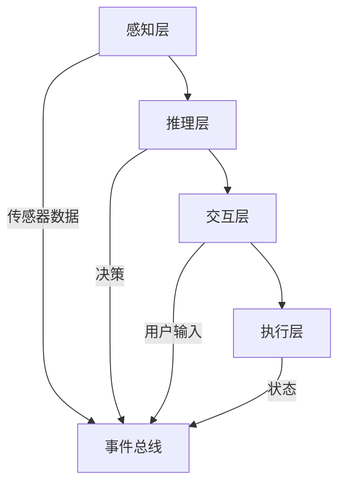
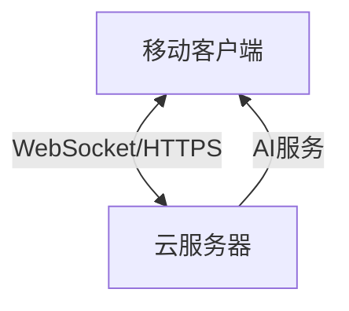
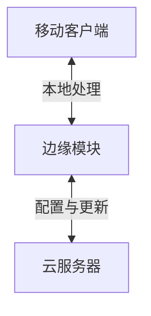
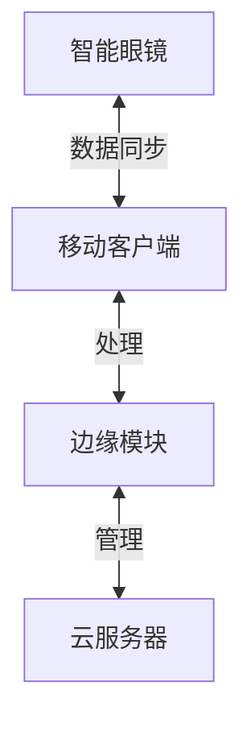
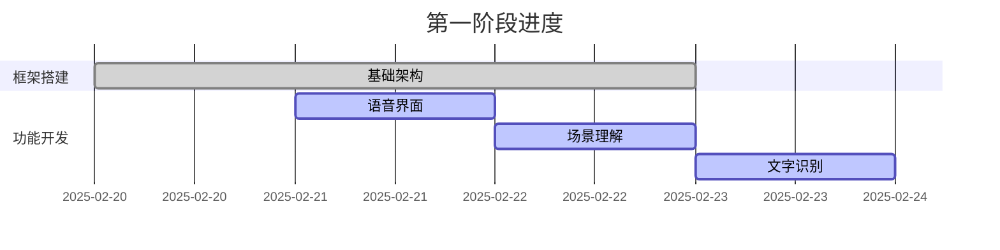
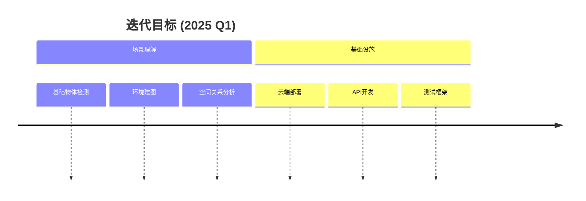

  <h1>🔍 VISTA</h1>
  
<strong>视觉智能辅助系统（面向视障群体）</strong>

  
  
  
  
  
  
  
  [English](README.md) | [中文](README_zh.md)
  
  <!--  -->

## 🌟 项目愿景

VISTA致力于通过前沿AI技术革新视障群体(BLV)与环境的交互方式。超越传统辅助工具的范畴，VISTA旨在成为一个全方位的多模态AI伴侣，全面提升用户的感知、认知和交互能力。

## 🎯 核心挑战与解决方案

| 挑战 | 解决方案 |
|---------|------------|
| 🚶‍♂️ **导航与移动** | 先进的传感器融合技术(毫米波雷达 + LiDAR)，全天候感知 |
| 👥 **社交互动** | 实时社交线索解读和非视觉反馈 |
| 📱 **数字无障碍** | 跨设备平台的无缝多模态交互 |
| 🏥 **医疗健康** | 智能医疗辅助和健康监测 |

## 🏗️ 系统架构

### 核心组件

1. **感知系统**
   - 多传感器融合
   - 环境建图
   - 实时目标追踪
   - 空间音频处理

2. **推理引擎**
   - 场景理解 (GPT-4V)
   - 风险评估
   - 路径规划
   - 上下文感知

3. **交互界面**
   - 自然语言处理
   - 触觉反馈系统
   - 3D音频导航
   - 手势识别

## 🛠️ 技术栈

<table>
  <tr>
    <th>层级</th>
    <th>技术</th>
    <th>特性</th>
  </tr>
  <tr>
    <td>前端</td>
    <td>
      
    </td>
    <td>
      - 跨平台支持 
      - 无障碍UI/UX 
      - 实时处理能力
    </td>
  </tr>
  <tr>
    <td>后端</td>
    <td>
      
    </td>
    <td>
      - 高性能API 
      - 异步处理 
      - 可扩展架构
    </td>
  </tr>
  <tr>
    <td>AI服务</td>
    <td>
      
    </td>
    <td>
      - 场景理解 
      - 多模态融合 
      - 上下文感知
    </td>
  </tr>
</table>

## 📦 相关仓库

### 核心组件
- 📱 [Vista-frontend](https://github.com/shaowenfu/Vista-frontend) - Flutter移动应用
- 🖥️ [Vista-backend](https://github.com/shaowenfu/Vista_backend) - FastAPI后端服务

## 🗺️ 发展路线图

<table>
<tr>
<td width="33%" valign="top">
<h3>🌤️ 第一阶段：云端架构（当前）</h3>

**核心组件**
- 📱 **移动应用**
  - 轻量级界面
  - 实时相机
  - 音频输入输出
  - 状态管理
  - 网络层

- ☁️ **云服务器**
  - 视觉分析
  - 语音处理
  - 多模态融合
  - 实时处理

**通信方案**
- WebSocket流传输
- RESTful接口
- MQTT状态同步

</td>
<td width="33%" valign="top">
<h3>🌥️ 第二阶段：边缘计算</h3>

**关键更新**
- 🚀 本地AI推理
- ⚡ 超低延迟（~10ms）
- 🔒 强化隐私保护
- 📊 带宽优化
- 💪 提升可靠性

**架构转变**
- 边缘AI部署
- 云端管理
- 协议优化
</td>
<td width="33%" valign="top">
<h3>⛅ 第三阶段：可穿戴整合</h3>

**创新特性**
- 🕶️ 智能眼镜集成
- 📡 网状网络
- 🤝 设备同步
- 🔄 无缝更新
- 🎯 情境感知

**优势**
- 解放双手操作
- 实时辅助
- 增强移动性
</td>
</tr>
</table>

📊 进度 (25%)

**当前状态**
- ✅ 项目初始化
- ✅ 基础架构搭建
- ✅ CI/CD流程
- 🚧 场景理解模块
- ⏳ 文字识别系统
- ⏳ 语音交互界面
- ⏳ 实时处理系统

### 📈 总体进度

<table>
<tr>
<th>阶段</th>
<th>状态</th>
<th>进度</th>
<th>时间线</th>
</tr>
<tr>
<td>云端架构</td>
<td>🚧 进行中</td>
<td>
25%
</td>
<td>2025 Q1</td>
</tr>
<tr>
<td>边缘计算</td>
<td>⏳ 已规划</td>
<td>
0%
</td>
<td>2025 Q2</td>
</tr>
<tr>
<td>可穿戴整合</td>
<td>⏳ 已规划</td>
<td>
0%
</td>
<td>2025 Q2</td>
</tr>
</table>

### 🎯 当前迭代重点

## 🔬 研究领域

- **传感器融合**：结合多种传感器输入实现稳健的环境感知
- **隐私计算**：联邦学习与差分隐私保护
- **多模态AI**：跨模态学习与理解
- **边缘智能**：分布式AI处理与优化

## 🤝 贡献指南

我们欢迎开发者、研究人员和领域专家的贡献！提交PR前请阅读[贡献指南](CONTRIBUTING.md)。

## 📄 开源协议

本项目采用MIT协议 - 详见[LICENSE](LICENSE)文件。

## 📚 文档

- [架构设计](https://github.com/shaowenfu/VISTA/blob/main/Docs_simplified_Chinese/architecture_zh.md)
- [需求分析](https://github.com/shaowenfu/VISTA/blob/main/Docs_simplified_Chinese/requirements_zh.md)
- [MVP产品计划](https://github.com/shaowenfu/VISTA/blob/main/Docs_simplified_Chinese/MVP_plan_zh.md)
- [API文档](https://github.com/shaowenfu/Vista_backend/docs/api.md)

## 🌐 社区

- [讨论区](https://github.com/shaowenfu/Vista/discussions)
- [问题追踪](https://github.com/shaowenfu/Vista/issues)
- [项目Wiki](https://github.com/shaowenfu/Vista/wiki)
