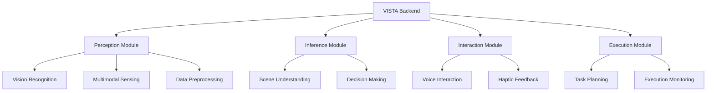

<div align="center">

# 🌟 VISTA Backend | VISTA 后端系统

<p align="center">
  
  
  
  
</p>

[English](./README.md) | [简体中文](./README_zh.md)

VISTA (Visual Intelligence Support & Technical Assistant) is an intelligent scene understanding and interaction assistance backend system based on multimodal large models.

VISTA (视觉智能支持与技术助手) 是一个基于多模态大模型的场景理解和交互辅助服务后端系统。

</div>

---

## ✨ Features | 功能特点

<table>
  <tr>
    <td>🔍 Scene Understanding</td>
    <td>Powered by GPT-4V for comprehensive scene analysis</td>
  </tr>
  <tr>
    <td>📝 Text Recognition & TTS</td>
    <td>Integrated OCR and Edge TTS for text recognition and speech synthesis</td>
  </tr>
  <tr>
    <td>🎯 Object Detection</td>
    <td>Real-time object detection using YOLOv8</td>
  </tr>
  <tr>
    <td>🤝 Multimodal Interaction</td>
    <td>Natural interaction with voice and haptic feedback</td>
  </tr>
</table>

## 🏗️ Architecture | 系统架构



## 🛠️ Tech Stack | 技术栈

<div align="center">

| Category | Technologies |
|----------|-------------|
| **Framework** |  |
| **AI Models** |   |
| **Speech** |   |
| **Monitoring** |  |

</div>

## 🚀 Quick Start | 快速开始

### Prerequisites | 环境要求

```bash
# Clone the repository
git clone https://github.com/your-username/vista-backend.git
cd vista-backend

# Create and activate virtual environment
python -m venv venv
source venv/bin/activate  # Linux/Mac
# or
venv\Scripts\activate     # Windows

# Install dependencies
pip install -r requirements.txt

# Configure environment
cp .env.example .env

# Start the server
uvicorn app.main:app --reload
```

## 📚 API Documentation | API文档

<details>
<summary>Click to expand | 点击展开</summary>

### Perception Module | 感知模块
- `POST /api/perception/vision/detect`
- `GET /api/perception/sensing/collect`
- `POST /api/perception/preprocessing/enhance`

### Inference Module | 推理模块
- `POST /api/inference/scene/understand`
- `POST /api/inference/decision/make`

### Interaction Module | 交互模块
- `POST /api/interaction/speech/recognize`
- `POST /api/interaction/speech/synthesize`
- `POST /api/interaction/haptic/generate`

### Execution Module | 执行模块
- `POST /api/execution/task/plan`
- `GET /api/execution/task/{task_id}/status`
- `GET /api/execution/metrics`

</details>

## 📁 Project Structure | 项目结构

<details>
<summary>Click to expand | 点击展开</summary>

```
vista_backend/
├── 📁 app/
│   ├── 📄 main.py
│   ├── 📁 routers/
│   └── 📁 models/
├── 📁 perception/
├── 📁 inference/
├── 📁 interaction/
├── 📁 execution/
├── 📁 docs/
├── 📁 tests/
├── 📄 requirements.txt
└── 📄 README.md
```

</details>

## 🔧 Development | 开发指南

```bash
# Code formatting
black .
isort .

# Run tests
pytest
pytest --cov=app tests/

# Build Docker image
docker build -t vista-backend .
docker run -d -p 8000:8000 vista-backend
```

## 🤝 Contributing | 贡献指南

1. Fork the Project | 复刻项目
2. Create your Feature Branch | 创建特性分支 (`git checkout -b feature/AmazingFeature`)
3. Commit your Changes | 提交更改 (`git commit -m 'Add some AmazingFeature'`)
4. Push to the Branch | 推送到分支 (`git push origin feature/AmazingFeature`)
5. Open a Pull Request | 创建Pull Request

## 📄 License | 许可证

This project is licensed under the MIT License - see the [LICENSE](LICENSE) file for details.

本项目采用 MIT 许可证 - 查看 [LICENSE](LICENSE) 文件了解详情。

## 📬 Contact | 联系方式

<p align="center">
  <a href="mailto:shaowenfu.pg@gmail.com">
    
  </a>
  <a href="https://github.com/shaowenfu">
    
  </a>
</p>

---

<div align="center">

**Star this repository if you find it helpful! | 如果觉得有帮助，请给个星标！**

</div>
