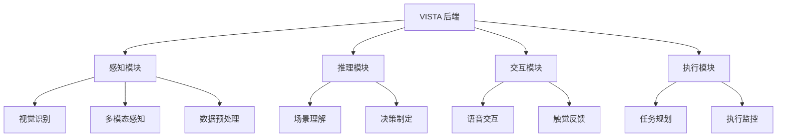

<div align="center">

# 🌟 VISTA 后端系统

<p align="center">
  
  
  
  
</p>

[English](./README.md) | [简体中文](./README_zh.md)

VISTA (视觉智能支持与技术助手) 是一个基于多模态大模型的场景理解和交互辅助服务后端系统。

</div>

---

## ✨ 功能特点

<table>
  <tr>
    <td>🔍 场景理解</td>
    <td>使用 GPT-4V 进行全面的场景分析</td>
  </tr>
  <tr>
    <td>📝 文字识别与朗读</td>
    <td>集成 OCR 和 Edge TTS 实现文本识别和语音合成</td>
  </tr>
  <tr>
    <td>🎯 物体检测</td>
    <td>基于 YOLOv8 的实时物体检测</td>
  </tr>
  <tr>
    <td>🤝 多模态交互</td>
    <td>支持语音和触觉反馈的自然交互</td>
  </tr>
</table>

## 🏗️ 系统架构



## 🛠️ 技术栈

<div align="center">

| 类别 | 技术 |
|----------|-------------|
| **Web框架** |  |
| **AI模型** |   |
| **语音处理** |   |
| **监控** |  |

</div>

## 🚀 快速开始

### 环境要求

```bash
# 克隆仓库
git clone https://github.com/your-username/vista-backend.git
cd vista-backend

# 创建并激活虚拟环境
python -m venv venv
source venv/bin/activate  # Linux/Mac
# 或
venv\Scripts\activate     # Windows

# 安装依赖
pip install -r requirements.txt

# 配置环境变量
cp .env.example .env

# 启动服务器
uvicorn app.main:app --reload
```

## 📚 API文档

<details>
<summary>点击展开</summary>

### 感知模块
- `POST /api/perception/vision/detect`: 物体检测
- `GET /api/perception/sensing/collect`: 传感器数据采集
- `POST /api/perception/preprocessing/enhance`: 数据增强处理

### 推理模块
- `POST /api/inference/scene/understand`: 场景理解
- `POST /api/inference/decision/make`: 决策制定

### 交互模块
- `POST /api/interaction/speech/recognize`: 语音识别
- `POST /api/interaction/speech/synthesize`: 语音合成
- `POST /api/interaction/haptic/generate`: 触觉反馈生成

### 执行模块
- `POST /api/execution/task/plan`: 任务规划
- `GET /api/execution/task/{task_id}/status`: 任务状态查询
- `GET /api/execution/metrics`: 执行指标查询

</details>

## 📁 项目结构

<details>
<summary>点击展开</summary>

```
vista_backend/
├── 📁 app/                # 主应用目录
│   ├── 📄 main.py        # 主程序入口
│   ├── 📁 routers/       # 路由模块
│   └── 📁 models/        # 数据模型
├── 📁 perception/         # 感知模块
├── 📁 inference/         # 推理模块
├── 📁 interaction/       # 交互模块
├── 📁 execution/         # 执行模块
├── 📁 docs/              # 文档
├── 📁 tests/            # 测试用例
├── 📄 requirements.txt   # 项目依赖
└── 📄 README.md         # 项目说明
```

</details>

## 🔧 开发指南

```bash
# 代码格式化
black .
isort .

# 运行测试
pytest
pytest --cov=app tests/

# 构建Docker镜像
docker build -t vista-backend .
docker run -d -p 8000:8000 vista-backend
```

## 🤝 贡献指南

1. Fork 本项目
2. 创建特性分支 (`git checkout -b feature/AmazingFeature`)
3. 提交更改 (`git commit -m '添加某个特性'`)
4. 推送到分支 (`git push origin feature/AmazingFeature`)
5. 创建 Pull Request

## 📄 许可证

本项目采用 MIT 许可证 - 查看 [LICENSE](LICENSE) 文件了解详情。

## 📬 联系方式

<p align="center">
  <a href="mailto:shaowenfu.pg@gmail.com">
    
  </a>
  <a href="https://github.com/shaowenfu">
    
  </a>
</p>

---

<div align="center">

**如果觉得有帮助，请给个星标！⭐**

</div> 